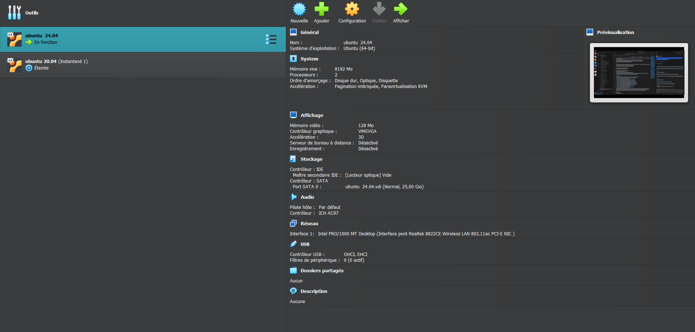
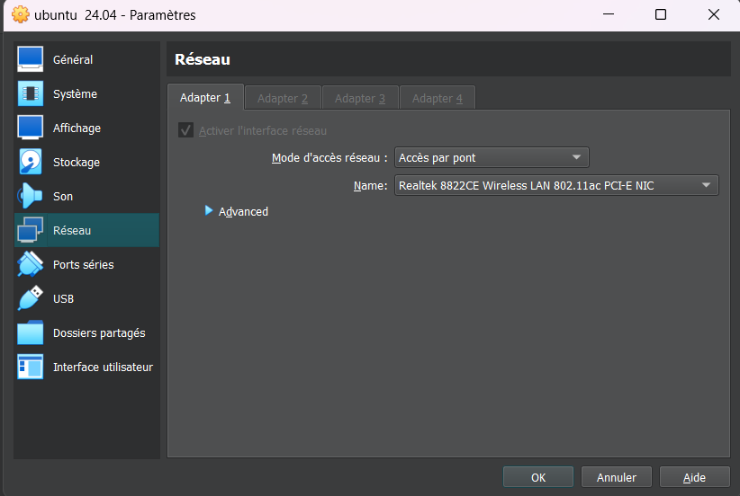
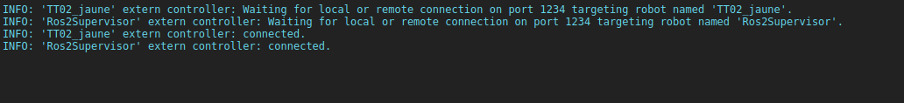

# Step-by-Step Guide: Creating an Interface Between Webots and ROS 2

This guide provides a detailed walkthrough for setting up an interface between Webots and ROS 2.

## Recommended Resources

We highly recommend exploring the following resources:
- [Setting Up Simulation with Webots (Basic)](https://docs.ros.org/en/humble/Tutorials/Advanced/Simulators/Webots/Setting-Up-Simulation-Webots-Basic.html)

## Installing Webots on Ubuntu 24.04

To install Webots, use the following command:
```bash
sudo apt-get install ros-humble-webots-ros2
```
**For setting up Ubuntu 24.04 on a virtual machine, refer to this guide:** [Setup Ubuntu on oracle VM](https://www.youtube.com/watch?v=X3O7GtLTdfo&t=28s).
- Very important : be sure to have those parameteres in the oracle VM


---

## Steps to Create the Interface

### Step 1: Create a Workspace
```bash
mkdir webot_simulation/src
```

### Step 2: Create a Package Inside `src`
```bash
cd webot_simulation/src
ros2 pkg create --build-type ament_python your_pkg_name_be_creative_but_change_this_it_getting_too_long_for_a_pkg_name_LOL  --dependencies rclpy geometry_msgs webots_ros2_driver
```
> **Note:** Replace `your_pkg_name_be_creative_but_change_this_it_getting_too_long_for_a_pkg_name_LOL ` with a meaningful name.

### Step 3: Update `package.xml`
Ensure the following dependencies are included in your `package.xml`:
```xml
<buildtool_depend>ament_python</buildtool_depend>
<exec_depend>rclpy</exec_depend>
<exec_depend>builtin_interfaces</exec_depend>
<exec_depend>webots_ros2_driver</exec_depend>
<exec_depend>webots_ros2_control</exec_depend>
<exec_depend>diff_drive_controller</exec_depend>
<exec_depend>joint_state_broadcaster</exec_depend>
<exec_depend>robot_state_publisher</exec_depend>
<exec_depend>controller_manager</exec_depend>
<exec_depend>tf2_ros</exec_depend>
<exec_depend>geometry_msgs</exec_depend>
<exec_depend>rviz2</exec_depend>
```
> **Tip:** Some dependencies may not be used immediately.We might use those dependencies to create a cmd_vel and cmd_dir topic to be able to simulate the real architecture, just add those dependencies to avoid future headaches.

### Step 4: Create Required Directories
Navigate to your package directory:
```bash
cd webot_simulation/src/your_pkg_name_i_won't_be_too_long_this_time
```
Create the following directories:
```bash
mkdir launch
mkdir worlds
mkdir proto
```
- the zip file is from : [zip file location](https://github.com/ajuton-ens/CourseVoituresAutonomesSaclay/blob/main/Simulateur/Simulateur_CoVAPSy_Webots2023b_Base.zip)
- worlds will contain the wbt files more on that after
- proto will contain the proto files of the car : get them from zip file/protos/ and  move them in the proto directory
- launch will contain ......🥁 🥁 🥁 launch files to the suprise of no one

### Step 5: Add World Files
- Add `.wbt` files to the `worlds` directory:
    - `Piste_CoVAPSy_2023b.wbt` (from `zip file/covapsy/world/`)
    - `piste_enscopy.wbt` (from [GitHub](https://raw.githubusercontent.com/SU-Bolides/simulation_ros2/main/webots_simulation/worlds/piste_enscopy.wbt))

#### Important Notes on `.wbt` Files
- Import the proto files at the top of the `.wbt` file:
    ```plaintext
    EXTERNPROTO "../protos/TT02_2023b.proto"
    ```
- Ensure the `TT02_2023b.proto` file is in the `proto` directory.
- Example robot definition in `.wbt`:
    ```plaintext
    TT02_2023b {
        translation 0 0 0
        name "TT02_jaune"
        controller "<extern>"
        color 0.69 0.7 0.2
    }
    ```
    - **Translation:** This defines the car's starting position in the simulation. You can adjust the `translation` values (`x`, `y`, `z`) directly in the Webots application. However, if you want the car to load at the same position every time, update the `translation` values in the `.wbt` file.

    - **Robot Name:** The `name` of the robot is **very important**. Remember this name because, when you launch the car, it does not have a native Python/C++ controller in Webots. Instead, it waits for an external controller connection. The Webots simulation listens for this connection, and the `WebotsController` in the launch file must use the same name as the one specified in the `.wbt` file.


    > **Note:** If you encounter issues with the external connection not being established, it is likely due to a mismatch between the robot name in the `.wbt` file and the name in the launch file.



### Step 6: Add Driver Script
- To your package ur_pkg_name_seriously_now/ur_pkg_name_seriously_now add your driver script (e.g., `my_driver.py`). 
- Refer to the following examples for implementation:
    - [Tesla Driver](https://github.com/cyberbotics/webots_ros2/blob/master/webots_ros2_tesla/webots_ros2_tesla/tesla_driver.py) : current logic
    - We could implement a different driver to be able to send cmd_vel as a topic however the driver should be similair to this [Basic Driver Setup](https://docs.ros.org/en/humble/Tutorials/Advanced/Simulators/Webots/Setting-Up-Simulation-Webots-Basic.html). Go to the third title Edit the my_robot_driver plugin and edit the wbt file to add   the hinge joint , the rotational motor distance sensor etc , refer the wbt file given in the second title of [Basic Driver Setup](https://docs.ros.org/en/humble/Tutorials/Advanced/Simulators/Webots/Setting-Up-Simulation-Webots-Basic.html)

Be sure to update `setup.py` to have the equivalent of the following:
```python
'my_robot_driver = my_package.my_robot_driver:main'
```

### Step 7: URDF File
In a classical ROS 2 setup, the URDF file is used to describe the robot’s physical structure (geometry, joints, links, etc.) so that tools like RViz, Gazebo, or MoveIt can interpret the robot's configuration.

However, in Webots, the geometry and physical properties of the robot are defined in PROTO files instead. Therefore, the URDF is not used for rendering or physics in Webots. Instead, its role in this context is mainly to bridge ROS 2 and Webots, by:

- Providing a consistent robot description to ROS 2 tools (e.g., `robot_state_publisher`).
- Allowing the use of standard ROS 2 workflows, like launching the controller and TF broadcasting.

In Webots, to control a robot with ROS 2, we typically use a controller `<extern>` in the PROTO or world file. This tells Webots to:

- Not run a local C++/Python Webots controller.
- Instead, look for a ROS 2 node running outside (externally), which will act as the robot’s controller.

So when we launch the robot with a ROS 2 launch file, it:

1. Loads the URDF to publish the robot’s description.
2. Starts the external ROS 2 node (your controller).
3. And Webots matches it via `<extern>` and links the control loop.

- In your ressource add your URDF file : mine is currently voiture_webots.urdf
be sure to have the following.
- Example URDF snippet:
    ```xml
    <?xml version="1.0" ?>
    <robot name="TT02_jaune">
            <webots>
                    <plugin type="<pkg_name>.<driver_name>.<class_name>" />
            </webots>
    </robot>
    ```
Remember the URDF file name as you will add it in the launch file. Be careful because often headaches come from simple spelling mistakes.

You can add sensors in the URDF file, like in the example provided in the [Edit my_robot.urdf](https://docs.ros.org/en/humble/Tutorials/Advanced/Simulators/Webots/Setting-Up-Simulation-Webots-Advanced.html) section.

Alternatively, you can add motors, such as rear motors, by referring to this file: [TurtleBot URDF Example](https://github.com/cyberbotics/webots_ros2/blob/master/webots_ros2_turtlebot/resource/turtlebot_webots.urdf). 

If you follow the aforementioned URDF file, ensure that the `ros2control` dependency is included in your `package.xml` and that the `ros2control.yml` file is present. Additionally, make sure to uncomment the relevant code sections mentioned in the launch file.

### Step 8: Launch File
- Add your launch file one good exemple is this [example launch file](https://github.com/cyberbotics/webots_ros2/blob/master/webots_ros2_tesla/launch/robot_launch.py).
### Step 8.1: Launch File Details

In your launch file, follow these steps:

1. **Import Required Modules**: Import `WebotsController` and `WebotsLauncher` along with other necessary modules mentioned in the launch file.

2. **Launch Webots Simulation**: Use the `WebotsLauncher` object to start a Webots simulation instance. Specify the world file to open in the constructor:
    ```python
    webots = WebotsLauncher(
        world=PathJoinSubstitution([package_dir, 'worlds', world]),
        mode=mode,
        ros2_supervisor=True
    )
    ```

3. **Load the Correct URDF File**: Ensure the correct URDF file is loaded:
    ```python
    robot_description_path = os.path.join(package_dir, 'resource', 'your_file_name.urdf')
    ```

4. **Set Up `<extern>` Controller**: Use `WebotsController` to set up the `<extern>` controller. Ensure the robot name matches the one defined in the `.wbt` file, and provide the URDF file path as the second option.

5. **Declare World Path**: Update the world path inside the launch description:
    ```python
    return LaunchDescription([
        DeclareLaunchArgument(
            'world',
            default_value='piste_ens.wbt',
            description='Choose one of the world files from `/webot_simulation/world` directory'
        ),
    ])
    ```

6. **Enable ROS 2 Supervisor**: Set `ros2_supervisor=True` to enable ROS 2 to act as a controller. This allows the supervisor API to control or interact with the simulation world through topics and services.

7. **Include Webots and Supervisor in Return Statement**: Ensure `webots` and `webots._supervisor` are included in the `LaunchDescription` return statement.

8. **Declare Driver and Nodes**: Declare the driver and nodes in the return statement, for example:
    ```python
    some_driver = WebotsController()  #definied in the generate_launch_description()
    some_node = Node() #definied in generate_launch_description()
    return LaunchDescription([
        some_driver,
        some_node,
    ])
    ```

By following these steps, your launch file will be properly configured to integrate Webots with ROS 2.
### Step 9: Setup Configuration
- Add necessary data files in `setup.py`:
    ```python
    data_files = []
    data_files.append(('share/ament_index/resource_index/packages', ['resource/' + package_name]))
    ```

for every launch file do this 
```python
    data_files.append(('share/' + package_name + '/launch',  ['launch/webot_launch.py']))
```
for every file in the ressource package do this 
```python
    data_files.append(('share/' + package_name + '/resource', [
    'resource/voiture_webots.urdf',
    'resource/ros2control.yml',
])) 
```
for every file in worlds do this 
```python
    data_files.append(('share/' + package_name + '/worlds', [
    'worlds/piste_ens.wbt',])) # TO DO CHANGE WORLDS FILE
```
and add this 
```python
    data_files.append(('share/' + package_name, ['package.xml']))
```

and the control scripts be sure to add every node like this: 
```python
entry_points={
        'console_scripts': [    
            'teleop = webot_simulation.teleop:main',
            'obstacle_avoider = webot_simulation.obstacle_avoider:main'
        ],
        'launch.frontend.launch_extension': ['launch_ros = launch_ros']
    }
```


By following these steps, you will successfully create an interface between Webots and ROS 2. Happy coding!


Please if you have any problem setting up the webot ros2 interface be sure to recheck this tutorial !!!

💬 Still stuck? Feel free to contact me: [imadeddine.ghomari@yahoo.com](mailto:imadeddine.ghomari@yahoo.com)
